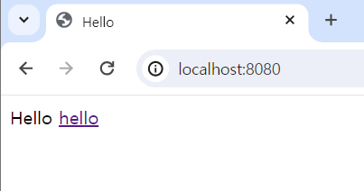
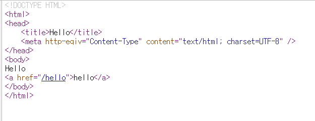
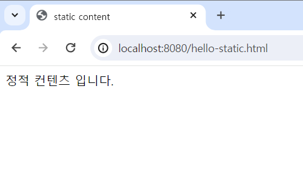
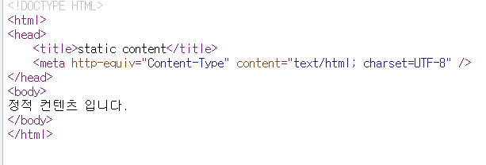
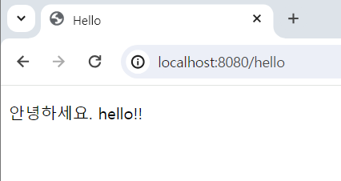
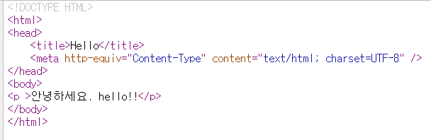

---
title:  "Spring-정적 컨텐츠, 템플릿 엔진"
categories: java
tag: [java]
toc: true
author_profile: false
sidebar:
    nav: "docs"
--- 

스프링의 웹 개발 기초에는 3가지가 있다.
- 정적 컨텐츠
- mvc와 템플릿 엔진
- api


# 정적 컨텐츠

정적컨텐츠는 welcome page와 같이 html 파일 자체를 그대로 웹 브라우저에게 넘겨주는 방식이다.

## Welcome Page

spring은 static/index.html을 올려두면 welcome page 기능을 제공한다. 
welcome page = 도메인을 입력할 때 처음 뜨는 화면
```html
<!DOCTYPE HTML>
<html>
<head>
    <title>Hello</title>
    <meta http-eqiv="Content-Type" content="text/html; charset=UTF-8" />
</head>
<body>
Hello
<a href="/hello">hello</a>
</body>
</html>
```


페이지 소스 코드를 보면 스프링에서 작성한 html 문서 그대로 입력된 것을 확인할 수 있다.

따라서 welcome page 처럼 static 폴더 아래 파일을 넣으면 작성한 html 파일이 장적으로 웹 브라우저에 프로그래밍 없이 그대로 반환된다.

다음, welcome page가 아닌 다른 정적 컨텐츠 파일을 만들어보자.

static/파일명.html 파일 안에 정적 컨텐츠 코드를 저장하고 localhost:8080/파일명.html을 입력하면 브라우저에 입력한 코드 내용을 불러올 수 있다.
```html
<!DOCTYPE HTML>
<html>
<head>
    <title>static content</title>
    <meta http-equiv="Content-Type" content="text/html; charset=UTF-8" />
</head>
<body>
정적 컨텐츠 입니다.
</body>
</html>
```



동작 원리를 보자면,
스프링의 내장 톰캣 서버가 요청을 받고 스프링에 넘긴다.
스프링은 우선적으로 컨트롤러에 요청받은 파일이 있는지 탐색한다. 맵핑된 컨트롤러가 없다면 내부에 있는 resorces/파일명.html 탐색한다. 있다면 웹 브라우저에 반환한다.


# mvc와 템플릿엔진

정적 페이지의 모양을 프로그래밍해서 원하는 대로 변경할 수도 있다.
이 동작을 위해 사용되는 3가지 controller, model, view(템플릿 엔진 화면)를 통틀어 mvc라고 한다.

mvc란 model view controller로 view와 model, controller를 일을 분리한다.
view : 화면과 관련한 일
model, controller : 비즈니스 로직, 서버 뒷단 관련한 일
컨트롤러나 뒷단 비즈니스 로직에서 처리하고 model에 그 관련한 화면에서 필요한 것들을 담아 화면 쪽에 넘겨주는 패턴으로 현재 많이 사용되는 방식이다.

```java
package hello.hellospring.controller;

import org.springframework.stereotype.Controller;
import org.springframework.ui.Model;
import org.springframework.web.bind.annotation.GetMapping;

@Controller
public class HelloController {
    @GetMapping("hello")
    public String hello(Model model) {
        model.addAttribute("data", "hello!!");
        return "hello";
    }
}
```
```html
<!DOCTYPE HTML>
<html xmlns:th="http://www.thymeleaf.org">
<head>
    <title>Hello</title>
    <meta http-equiv="Content-Type" content="text/html; charset=UTF-8" />
</head>
<body>
<p th:text="'안녕하세요. ' + ${data}" >안녕하세요. 손님</p>
</body>
</html>
```
여기서는 템플릿 엔진으로 Thymeleaf를 사용한다.
GetMapping("hello") : 웹 어플리케이션에 /hello를 입력하면 hello 메서드 호출.

Thymeleaf 문법 사용 방법
html 파일에 <html xmlns:th="http://www.thymeleaf.org"> 를 입력한다.
모델의 attribute에 add해서 key로 넣었던 data와 키값은 hello!!인데 hello.html의 ${data} 부분이 value로 치환된다.
html문서를 controller와 model을 사용해서 변경한 격이다.





파라미터로 값을 받아 변경하는 페이지를 만들어보자.
```java
    @GetMapping("hello-mvc")
    public String helloMvc(@RequestParam("name") String name, Model model){
        model.addAttribute("name",name);
        return "hello-template";
    }
```
```html
<html xmlns:th="http://www.thymeleaf.org">
<body>
<p th:text="'hello ' + ${name}">hello! empty</p>
</body>
</html>
```
이대로 hello-mvc 페이지를 불러오면 
required Stirng parameter 'name' 없음 오류가 발생한다.
파라미터로 받은 name 값을 설정해주지 않아서 발생한 오류인데,
도메인에 ?name=값 을 입력해서 파라미터를 넘길 수 있다.

동작방식
내장 톰캣 서버는 hello-mvc 요청을 받고 스프링에 넘긴다.
스프링은 controller에 요청받은 메서드가 맵핑되어 있는지 확인되면 그 메서드를 호출한다.
리턴해줄 때 모델의 키와 값을 스프링에 넘겨준다. 스프링이 viewResolver라는 화면과 관련된 해결자가 동작한다.
(화면을 찾아주고 템플릿을 연결해주는 역할)
templates/hello-template 이라는 return과 같은 템플릿을 찾아서 Thymeleaf 템플릿 엔진에 처리를 요청한다.
템플릿 엔진 : 랜더링해서 변환을 한 html을 웹 브라우저에 반환
페이지 소스코드를 보면 반환된 data 값이 html에 적용된 것을 확인할 수 있다.


